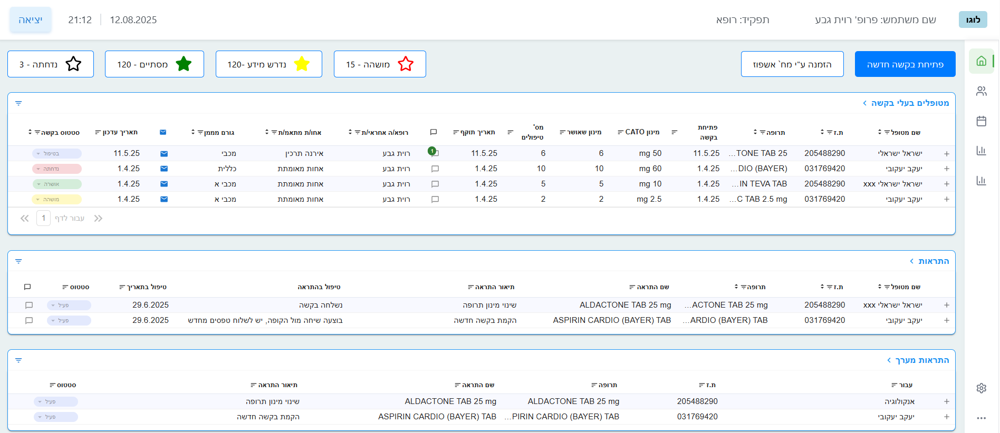

# Medical Dashboard

This project is a React application simulating a medical dashboard that displays statistical data, tables, and medical information in a clear and visual way.

## Project Description
For this task, I implemented the dashboard design based on a provided screenshot, with some minor adjustments to icons and sizes to improve appearance and usability. The project features React components styled with modular CSS and is responsive.

## Key Features
- Tables with filtering and sorting
- Graphs for data visualization
- Clean and modern design according to task requirements
- Responsive layout for mobile and desktop

## Screenshot

